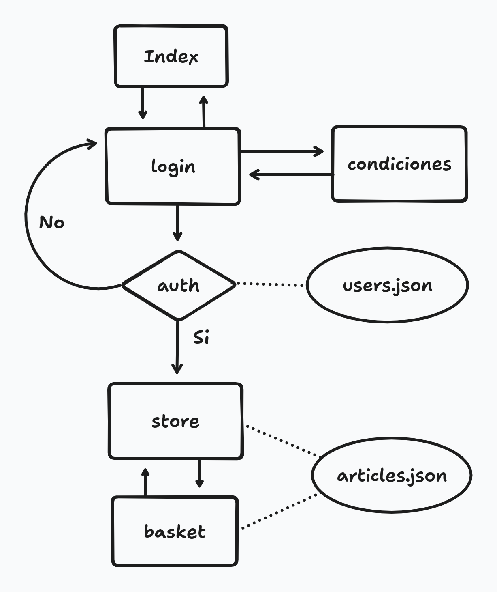
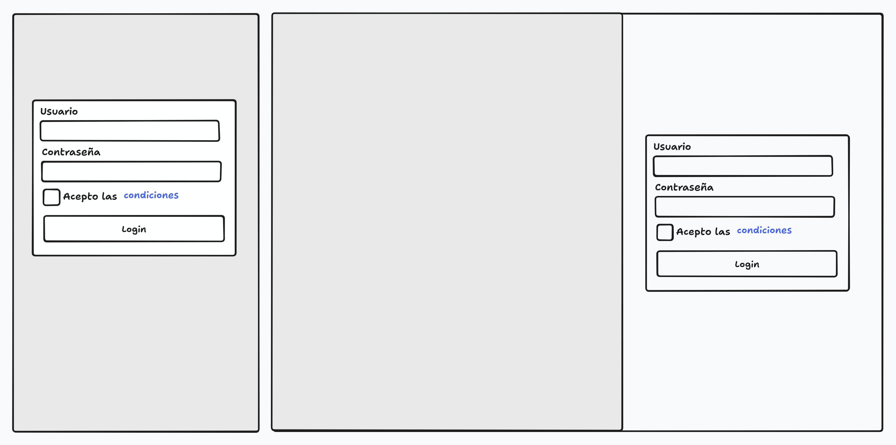
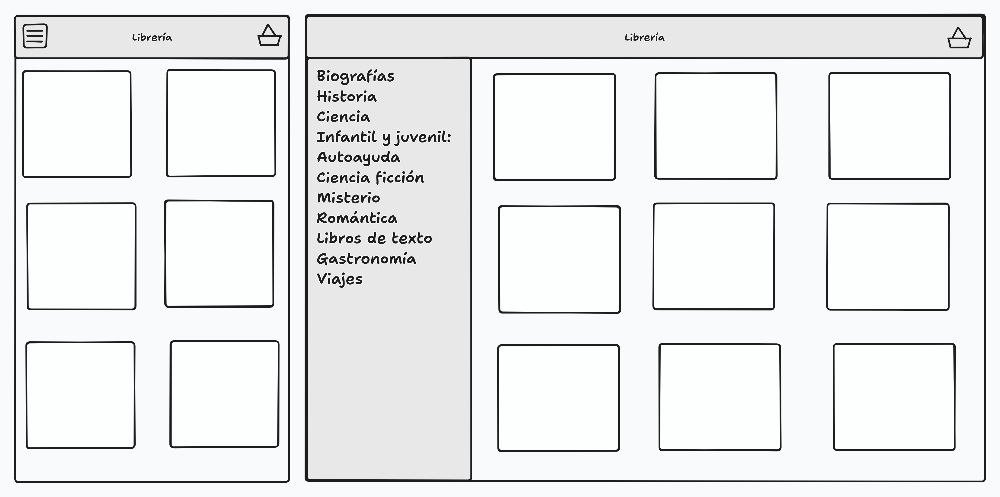
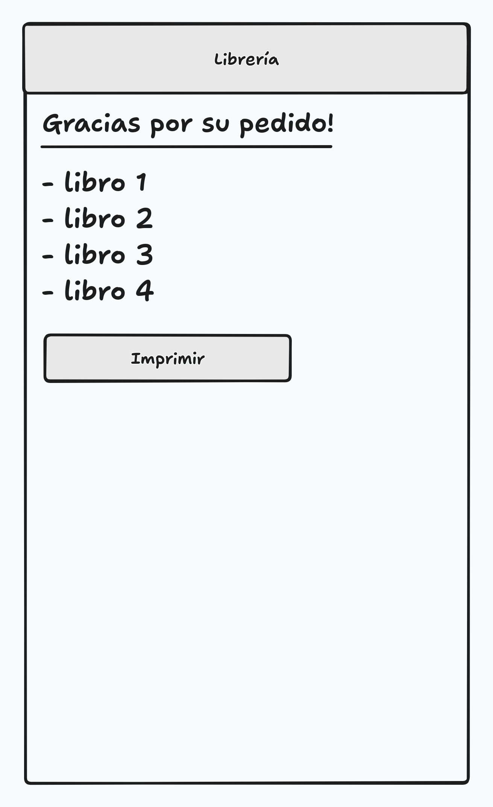

# Librería online

## Necesidad
Crear desde cero un escaparate de libros para socios, con capacidad de realizar pedidos que se puedan imprimir.

## Profesión:
Desarollador Frontend.

## Competencias
- Analizar un problema complejo y dividirlo en problemas sencillos.
- Definir y organizar las tareas para resolver el problema.
- Trabajo en equipo.
- Crear una interfaz de usuario web estática y adaptable.
- Crear un algoritmo sencillo para autenticación.
- Lectura y filtrado de datos remotos.
- Separación de datos y algoritmos.
- Preparar página para que sea impresa.

## Modalidad pedagógica
Trabajo en equipo.


## Modalidad de evaluación
Revisión de entregables por parte del profesorado.


## Entregables

HTML y recursos (imágenes y css) en un repositorio github.

Para hacer la entrega, el equipo deberá publicar el enlace al repositorio en el canal deberes-y-entregas de discord.

## Criterios de rendimiento
### Generales
- Toda la funcionalidad cubierta.
- Código correctamente indentado y limpio.
- Todos los tags correctamente abiertos/cerrados (https://validator.w3.org/).
- Comentarios de código donde se necesiten.
- Ficheros no-html en directorios aparte.
- Se valorará si se puede ver el avance a través de los commits.
- Se valorará si se puede ver la organización a través del kanban.
- Se valorará si se realizan tests que validen las funcionalidades.
- Se valorará si se realizan tests que validen las historias de usuario.
- Se valorará si se utilizan web-components.


### HTML
- Crear un layout que utilice etiquetas semanticas
- Utilizar cabeceras y títulos
- Si utilizas hypervínculos a webs externas, que se abrn en otra pestaña
- Que contenga imágenes
- Que el conteido sea coherente

### CSS
- Utilizar diferentes colores web definidas en variables
- Utiliza reglas CSS para cambiar el color o la imágen del fondo de algún elemento
- Utiliza diferentes tipografías con variedad de estilos y tamaños
- La web debe de ser responsive
- Buscar coherencia de estilo

### FORMULARIOS
- Crear un formulario que permita recoger datos de usuarios y que los envíe por GET
- Utilizar diferentes tipos de etiquetas de datos, con variedad de tipos
- Colocar una casilla de verificación que suponga la aceptación de la política de privacidad
- Las etiquetas utilizadas deben contener atributos específicos del formulario

### JAVASCRIPT
- Crear funciones diferenciadas por sus diferentes comportamientos
- Crear código coherente y ordenado (Clean Code).
- Utilizar objetos, métodos y atributos que inteactuen con el DOM
- Utilizar eventos para ejecutar acciones y scripts cuando carga la página.

### Varios
- Definir historias de usuario y reflejar el avance el kanban 
- Aplica las técnicas de optimización y no duplicacion de código
- Realizar tests unitarios y de validación
- Validar el funcionamiento general de la web.
- Utilización de estrategias SEO para optimizar el posicionamiento de buscadores y mejorar el rendimiento


## Descripción de las tareas a realizar:

Realizar una web siga el siguiente diagrama de flujo:


Toda la web ha de ser responsiva.

La página index es una ṕagina que muestra lo que es la librería y da acceso al login.

La página en la que se hace login y parecerse a esto:


El botón de "Login" ha de estar desabilitado si no se aceptan las condiciones.

Los usuarios se almacenan en en el archivo `users.json`

El store ha de ser una página que muestre las tarjetas de los libros que se pueden reservar. Se podrán filtrar por las etiquetas definidas.


Estas tarjetas serán web-components.

Al pulsar en cada tarjeta, éste se agregará a la cesta. Sólo podra haber una unidad de un libro en la cesta.

En la cesta, se verá el número de libros que se llevan acumulados.

Al puslar en la cesta, se redirigirá al usuario a la página donde podrá ver la información del los libros solicitados y lo podrá imprimir.

La impresión tendrá un estilo diferente al de la pantalla.

### A tener en cuenta
#### Formato de `users.json`
```
[
    { "username": "aaaaa", "password": "aaaaa" },
    ...
]
```
#### Formato de `books.json`
```
[
    { 
        "image": "aaaaa.aaa"
        "title": "aaaaa",
        "publish_date": "YYYY-MM-DD",
        "author": "aaaaa",
        "resume" : "Lorem Ipsum....",
        "tags": ["aaaaa", "bbbbb"]
    },
    ...
]
```

#### Gestión del tiempo
- Se dispone de poco tiempo por lo que éste deberá ser gestionado adecuadamente.
- Priorizad la funcionalidad.
- Es preferible una interfaz sencilla pero funcional que otra preciosa y recargada, que no funcione.
- Recordad que cuantos más elementos tengas en la pantalla, más tendrás que gestionar.
- Dedicarle tiempo a trazar un plan, definir bien las tareas, organizarlas dentro del equipo.
- Definid también cómo vais a coordinaros dentro del mismo repositorio.
- Recomendamos, para evitar conflictos, que hagais commits pequeños, y antes de hacerlo, hacer `git pull`para ver el código que hay en el repositorio.
